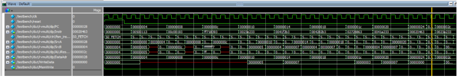

# RISCV-Multicycle-Processor
A multi-cycle processor of a cpu designed according to the instruction set (assembly language) of RISC-V using System Verilog HDL.

## Overview
This project implements a multicycle RISC-V processor using SystemVerilog. It is designed to execute a subset of the RISC-V instruction set architecture (ISA) and demonstrates a step-by-step implementation of the fetch, decode, execute, memory, and write-back cycles.

The multicycle approach optimizes resource usage by allowing different stages of the instruction execution to share hardware resources.

## Features
- Multicycle instruction execution.
- Implementation of core RISC-V instructions.
- Modular design for easier debugging and extensibility.
- Support for simulation using industry-standard tools.

## Architecture
The processor follows a classic multicycle architecture with the following components:
- **Instruction Fetch (IF)**: Fetches instructions from memory.
- **Instruction Decode (ID)**: Decodes the instruction and fetches operands.
- **Execute (EX)**: Performs ALU operations or calculates addresses.
- **Memory Access (MEM)**: Reads from or writes to memory.
- **Write Back (WB)**: Writes results back to the register file.

## Dependencies and Tools
- **Hardware Description Language**: SystemVerilog
- **Simulator**: ModelSim, QuestaSim, or other SystemVerilog-compatible simulators
- **Waveform Viewer**: GTKWave or equivalent

## Supported Instructions
This processor supports the following RISC-V instructions:
- **Arithmetic and Logical**: `ADD`, `SUB`, `AND`, `OR`, `XOR`, `SLT`, `SLL`, `SRL`, `SRA` 
- **Memory Access**: `LW`, `SW`
- **Branching**: `BEQ`, `JAL`
- **Immediate Operations**: `ADDI`, `ORI`

# Installation
1. Download all the necessary file
    - [top.sv](top.sv): Main code
    - [riscv_testbench.sv](riscv_testbench.sv): Testbench to confirm the output. Modify to how you want to use it.
    - [riscvtest.s](riscvtest.s): Test the RISC-V processor in RISCV assembly language. Modify to how you want to use it.
    - [riscvtest.txt](riscvtest.txt): Machine code. Modify to how you want to use it.
2. Open the `top.sv` in your preferred software such as Quartis, and compile if you modify any code.
3. Open the project in your preferred simulator, in this case I used ModelSim.
4. Run the testbench files in the `testbench` directory to verify functionality.
5. Analyze the waveform output using a waveform viewer.

# Modules and Diagrams
  
The picture above is the complete multicycle processor high level diagram of the RISC-V processor along with the signals naming used to guide the code.  

  
Figure 2 shows a simplify version of the project structure of a RISC-V Multicycle Processor between the connections of the Datapath, Controllers, Mememory, and signals in the top module.

## Top Module:
  
The picture represents the top module of RISC-V processor that contains the memory block and the processor itself as shown in Figure 2: Mutlticycle processor interfaced to external memories

## RISC-V Processor Module:
  
The RISC-V processor generally have Datapath and Controller unit. The Datapath is the signals that carry the data from the memory to registers, then to ALU unit, etc. The Controller on the other hand, is what interprets instructions and move on its FSM (finite state machine) to communite its control signals to datapath signals to evlaute/preform the instructions. As such, the control unit controls the data path.

## Datapath Module:
  
The Datapath module contains the register file, alu, pc registers, multiplexer, etc as explained above. 

## Controller Module
The Control unit would include the MainFSM, ALU_dec, and Instr_dec as shown below:
  

The FSM that is used for this project as shown as below of the basic version as a guideline:
  

# Simulation and Testing
The individual processors has been tested and each instructions has been tested as well. What I'm going to show you is a simulation results based on the `riscv_testbench.sv`. As mentioned before, the `riscvtest.s` is an assembly code written in RISC-V assembly language and the `riscvtest.txt` is the machine code from the riscvtest.s . 

